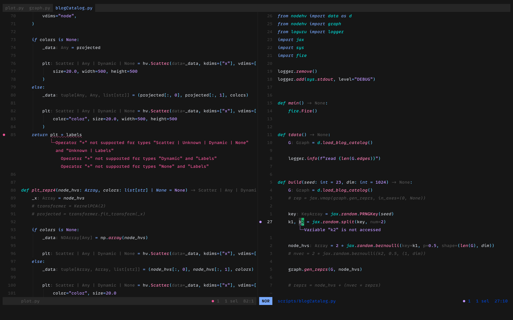

# Carbon Helix Theme

This is a theme for the [Helix](https://helix-editor.com/) text-editor that is inspired by
the [Carbon Design System](https://carbondesignsystem.com/).

## Installation

Copy the `carbon.toml` file into the `themes` directory of your helix config. If the themes
directory doesn't exist create one with `mkdir -p ~/.config/helix/themes` and move the 
`carbon.toml` file to the directory.

In your helix config add
```toml
theme = "carbon"
```

## Screenshot
Below are a few screenshots for Python, Lua and svelte.

### Python


### Lua


### Svelte

